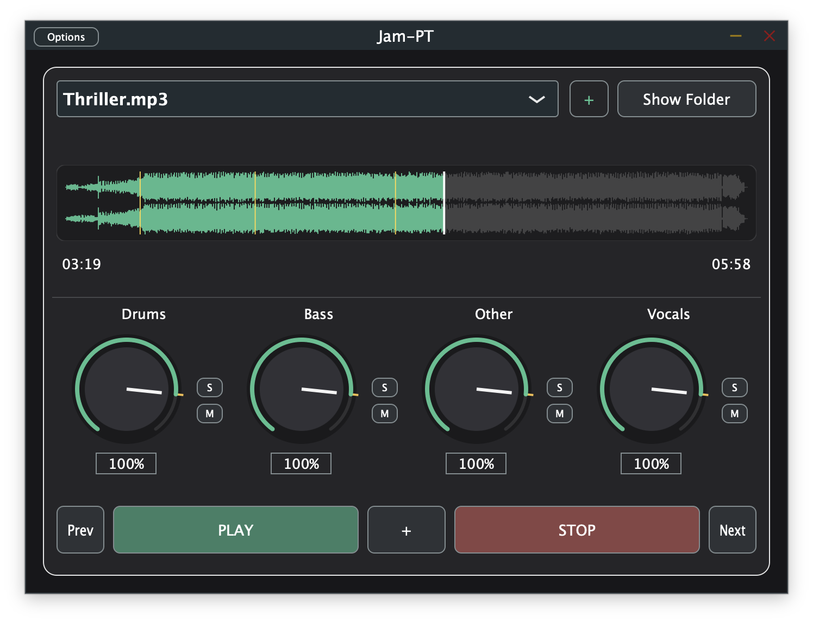

# Jam-PT

Jam-PT is a macOS practice plugin built with JUCE and CMake. It uses the external `demucs` CLI to separate a song offline, then mixes the generated `drums`, `bass`, `other`, and `vocals` stems in real time inside the plugin.



## What It Does

Jam-PT lets you:

- load a local audio file into the plugin
- cache the file in an app-managed library
- run Demucs offline in the background
- reuse cached stems instead of separating the same file again
- control stem levels with four dedicated knobs
- use per-stem `Solo` and `Mute`
- scrub the waveform and play the cached source
- place persistent markers and jump between them
- expose transport, marker, and stem toggle controls to AU hosts such as MainStage

The plugin does not embed Demucs, PyTorch, CoreML, or any model runtime internally. All separation is delegated to the external `demucs` executable already installed on the machine.

## Formats And Platform

- macOS
- Audio Unit generator (`AU`, `augn`)
- VST3
- Standalone app

## Code Layout

- `src/PluginProcessor.*`: plugin lifecycle, state restore, host parameters, transport routing
- `src/PluginEditor.*`: plugin UI, waveform, transport, markers, stem controls
- `src/AudioFilePlayer.*`: source-file playback
- `src/DemucsProcessor.*`: Demucs CLI orchestration, cache management, stem loading, markers, stem mixing

## Requirements

- macOS
- Xcode with Command Line Tools
- CMake 3.22+
- a working JUCE toolchain
- a working external `demucs` CLI installation visible to the host process

JUCE can be fetched automatically at configure time, so a global JUCE install is not required unless you want to build against a local checkout.

## Cache Layout

Jam-PT stores its working cache under:

```text
~/Library/Application Support/Jam-PT/DemucsCache/
```

Each source file gets its own folder named after the original file. If a folder with that name already exists for a different source, Jam-PT creates a suffixed variant such as `My Song.wav (2)`.

Inside each source folder, Jam-PT keeps:

```text
DemucsCache/
  My Song.wav/
    cache-info.xml
    source.wav
    spectrogram.thumb
    htdemucs/
      drums.wav
      bass.wav
      other.wav
      vocals.wav
```

### Cache contents

- `source.<ext>`: the cached copy of the selected source file, preserving the original extension
- `spectrogram.thumb`: cached waveform/spectrogram thumbnail used by the UI
- `<model>/`: one folder per Demucs model
- `cache-info.xml`: relative metadata for the cached source and its markers

### Metadata strategy

`cache-info.xml` stores portable metadata only:

- original file name
- original file size
- original modification timestamp
- cached source file name
- spectrogram cache file name
- marker positions

Absolute source paths are intentionally not stored in cache metadata, so the cache remains portable and self-contained.

## GUI Overview

The editor layout is:

1. Cached-file selector
2. `+` button to import a new source file
3. `Show Folder` button to open the selected cache folder in Finder
4. waveform / spectrogram area
5. position and duration labels under the waveform
6. four stem sections in this order:
   `Drums`, `Bass`, `Other`, `Vocals`
7. bottom transport / marker row:
   `Prev`, `Play/Pause`, `+`, `Stop`, `Next`
8. model selector footer

### Playback and waveform

- the waveform is read from `spectrogram.thumb` when available
- if no cached thumbnail exists, it is regenerated from `source.<ext>` and then saved
- a playhead is shown during playback
- marker positions are drawn as thin yellow vertical lines
- during stem generation, the waveform shows a loading spinner overlay

### Stem controls

Each stem has:

- a gain knob
- a `S` button for `Solo`
- a `M` button for `Mute`

Behavior is standard:

- if no stem is soloed, every non-muted stem plays
- if one or more stems are soloed, only soloed and non-muted stems play
- mute still wins if a stem is both soloed and muted

### Markers

Jam-PT supports persistent markers stored in `cache-info.xml`.

- `+` adds a marker at the current position
- if the playhead is already on a marker, `+` becomes `-` and removes it
- `Prev` jumps to the previous marker
- `Next` jumps to the next marker

Marker actions are available only when the plugin is in a ready state and do not force a transport state change by themselves.

To keep marker navigation useful during playback, `Prev` and `Next` use a tolerance window so repeated presses can continue moving across markers even while the playhead is advancing.

## Host Controls

For AU hosts, Jam-PT exposes these controls as automatable parameters:

- `Play/Pause`
- `Stop`
- `Previous Marker`
- `Toggle Marker`
- `Next Marker`
- `Vocals Solo`, `Vocals Mute`
- `Drums Solo`, `Drums Mute`
- `Bass Solo`, `Bass Mute`
- `Other Solo`, `Other Mute`

Hosts may render these as checkboxes or generic toggles rather than the exact JUCE button styling used in the plugin editor.

## Demucs Setup

Jam-PT depends on an external Demucs runtime. If `demucs` fails in Terminal, it will fail inside the plugin too.

### Recommended macOS setup

1. Install Python and FFmpeg:

```bash
brew install python@3.12 ffmpeg
```

`python@3.11` is also a good option. Avoid building your Demucs runtime around Python 3.14 unless you already know your local `torch`, `torchaudio`, and `torchcodec` versions are compatible.

2. Install `pipx` if needed:

```bash
brew install pipx
pipx ensurepath
```

Restart Terminal after `pipx ensurepath` so `~/.local/bin` is visible in `PATH`.

3. Remove any older broken Demucs environment:

```bash
pipx uninstall demucs
```

4. Install Demucs with an explicit Python interpreter:

```bash
pipx install --python /opt/homebrew/bin/python3.12 demucs
```

If you use Python 3.11 instead:

```bash
pipx install --python /opt/homebrew/bin/python3.11 demucs
```

5. Inject `torchcodec`:

```bash
pipx inject demucs torchcodec
```

### Verify the runtime before using Jam-PT

Confirm that the executable is visible:

```bash
which demucs
demucs --help
```

Then run a real separation test manually:

```bash
demucs -n htdemucs "/absolute/path/to/test-file.mp3"
```

If you need to set an output folder and the path contains spaces, quote every path argument:

```bash
demucs -n htdemucs -o "/Users/your-user/Library/Application Support/Jam-PT/DemucsCache" "/absolute/path/to/test-file.mp3"
```

### Common runtime issues

- `FFmpeg is not installed`
  Install FFmpeg with `brew install ffmpeg`.

- `No module named 'torchcodec'` or `TorchCodec is required`
  Run `pipx inject demucs torchcodec`.

- `Could not load libtorchcodec` with missing `libavutil.*.dylib`
  Your Demucs environment is mismatched or FFmpeg is missing. Reinstall Demucs after installing FFmpeg, preferably with Python 3.11 or 3.12.

- `No executable for the provided Python version 'python3.12' found in PATH`
  Install `python@3.12` with Homebrew and use the full interpreter path, for example `/opt/homebrew/bin/python3.12`.

### How Jam-PT locates Demucs

Jam-PT looks for `demucs` in common macOS locations first, including:

- `~/.local/bin/demucs`
- `/opt/homebrew/bin/demucs`
- `/usr/local/bin/demucs`

If it is not found there, the plugin falls back to the process `PATH`.

## Build

### Option A: fetch JUCE automatically

```bash
cmake -S . -B build -G Xcode -DJAMPT_FETCH_JUCE=ON
cmake --build build --config Release
```

### Option B: use a local JUCE checkout

```bash
cmake -S . -B build -G Xcode -DJAMPT_FETCH_JUCE=OFF -DJUCE_SOURCE_DIR=/path/to/JUCE
cmake --build build --config Release
```

For local development:

```bash
cmake -S . -B build-xcode -G Xcode -DJAMPT_FETCH_JUCE=ON
cmake --build build-xcode --config Debug --target Jam-PT
```

To build the VST3 target explicitly:

```bash
cmake --build build-xcode --config Debug --target Jam-PT_VST3
```

After configure, you can also open the generated Xcode project and build the `Standalone`, `AU`, or `VST3` targets from Xcode.

## Install

The project enables `COPY_PLUGIN_AFTER_BUILD`, so the plugin formats are normally copied automatically after a successful build.

If you need to install AU manually, copy the generated component bundle to:

```text
~/Library/Audio/Plug-Ins/Components/
```

If you need to install VST3 manually, copy the generated `.vst3` bundle to:

```text
~/Library/Audio/Plug-Ins/VST3/
```

Then rescan plugins in Logic Pro, MainStage, or your preferred host if needed.

If the AU still does not appear in MainStage after a rebuild, validate the component directly:

```bash
auval -v augn JmPt MtBs
```

If validation fails or the plugin is not listed, rebuild the `AU` target in `Release`, clear the Audio Unit cache if needed, and rescan the host.

## Host Notes

- `AU` is exposed as a generator (`augn`) for host use
- `VST3` is available for compatible hosts
- `Standalone` exists mainly for development and debugging
- MainStage should see the AU as a generator, not as an insert FX
- the plugin falls back to playing the cached source file until separated stems are ready
- once stems exist in cache for the selected source and model, Jam-PT reuses them automatically

## Current Limitations

- separation is offline per loaded file, so long files can still take noticeable time and disk space
- the plugin depends on an external Demucs runtime with compatible Python, FFmpeg, and TorchCodec
- only the stems produced by the selected Demucs model are reused
- no automated test suite is included yet

## License

Released under the MIT License. See [LICENSE](LICENSE).
